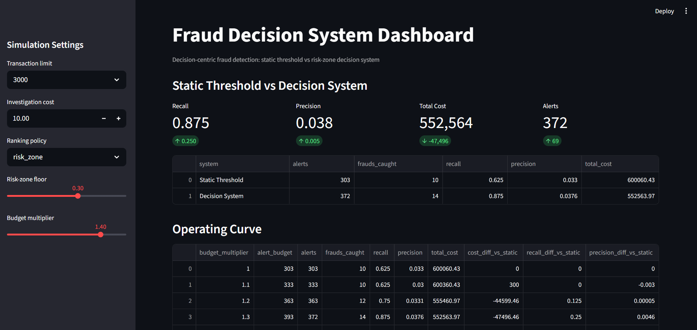
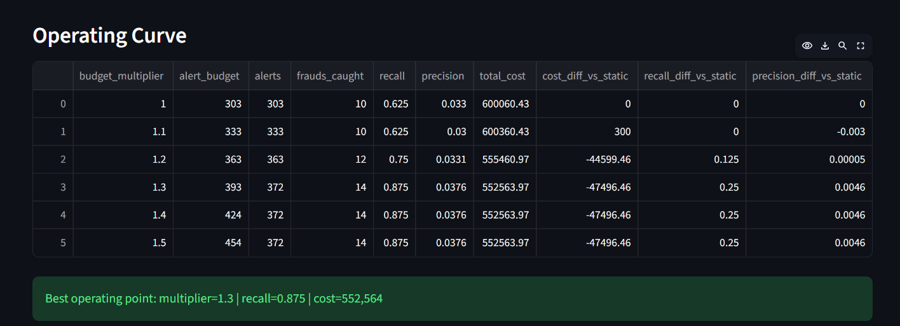
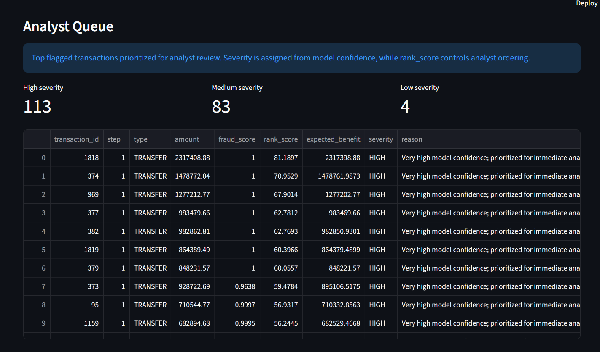

# Adaptive Fraud Intelligence

Decision-centric fraud detection system with adaptive alert selection, cost-aware ranking, operational monitoring, and real-time simulation support.

---

## Overview

Traditional fraud detection systems often optimize only predictive performance metrics such as ROC-AUC or precision.  
This project focuses instead on operational fraud decision-making under real-world investigation constraints.

The system combines machine learning fraud scoring with adaptive decision logic, investigation-budget management, analyst prioritization, and cost-aware alert selection to simulate realistic fraud operations workflows.

---

## Core Objectives

- Detect fraudulent financial transactions
- Reduce total operational fraud cost
- Improve fraud recall under investigation constraints
- Prioritize analyst review queues intelligently
- Simulate adaptive fraud monitoring workflows
- Compare static threshold systems against adaptive decision systems

---

## Features

### Machine Learning Layer

- Fraud probability scoring
- Transaction risk estimation
- Threshold evaluation
- Feature engineering pipeline
- Probability calibration support

### Decision Intelligence Layer

- Adaptive alert budgeting
- Cost-aware fraud ranking
- Investigation-capacity-aware alert selection
- Static threshold vs adaptive strategy comparison
- Risk-zone transaction prioritization
- Analyst queue optimization

### Monitoring & Simulation

- Sequential fraud simulation
- Operating curve analysis
- Monitoring metrics
- Real-time simulation support
- Alert volume analysis
- Operational performance tracking

### Interfaces

- FastAPI backend
- Streamlit interactive dashboard

---

## Main Result

Compared to the static threshold baseline, the adaptive decision system achieved improved fraud recall while simultaneously reducing total operational cost.

| System | Recall | Precision | Alerts | Total Cost |
|---|---|---|---|---|
| Static Threshold | 0.625 | 0.033 | 303 | 600,060 |
| Decision System | 0.875 | 0.038 | 372 | 552,563 |

### Key Outcome

The adaptive decision engine:

- Increased fraud recall by 25%
- Reduced total operational cost
- Maintained operationally manageable alert volumes
- Improved analyst prioritization efficiency

---

## Dashboard Preview

### Static Threshold vs Decision System



### Operating Curve Analysis



### Analyst Investigation Queue



---

## System Architecture

The platform includes:

- Fraud scoring pipeline
- Decision engine
- Adaptive thresholding logic
- Cost optimization module
- Operational monitoring layer
- Sequential simulation workflows
- FastAPI backend
- Streamlit dashboard

---

## Project Structure

```text
app/
    api/
    core/
    model/
    monitoring/
    tests/

decisioning/
    cost_logic.py
    decision_engine.py
    strategies.py
    suppression.py
    thresholding.py

scripts/
    evaluate_decision_strategies.py
    run_sequential_simulation.py
    run_realtime_demo.py
    plot_operating_curve.py

config/
models/
notebooks/
docs/

---

## Technologies

- Python
- Pandas
- NumPy
- Scikit-learn
- FastAPI
- Streamlit
- Matplotlib
- Joblib

---

## How To Run

### Install dependencies

```bash
py -m pip install -r requirements.txt
```

### Add dataset

Place dataset here:

```text
data/raw/AIML Dataset.csv
```

### Run FastAPI backend

```bash
py -m uvicorn app.api.main:app --reload
```

### Run Streamlit dashboard

```bash
py -m streamlit run app/dashboard.py
```

---

## Dataset

This project uses the PaySim synthetic financial transaction dataset.

The dataset is not included in the repository due to size limitations.

Expected dataset path:

```text
data/raw/AIML Dataset.csv
```

---

## Future Improvements

- Probability calibration improvements
- Drift detection
- Online learning
- Analyst feedback loops
- Queue-aware investigation allocation
- Dynamic risk adaptation
- Real streaming integration

---

## Thesis Context

This repository was developed as part of a Master's thesis focused on decision-centric fraud detection, adaptive transaction prioritization, cost optimization, and monitoring for real-time capable fraud systems.
